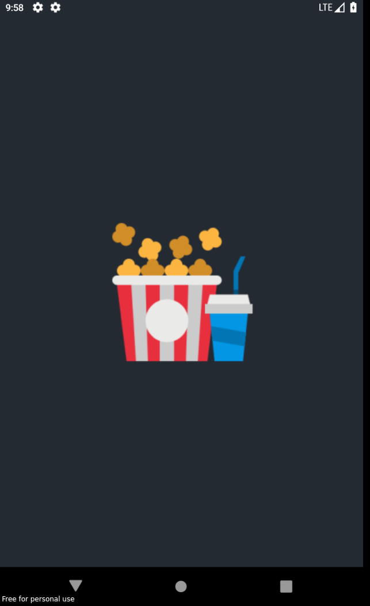
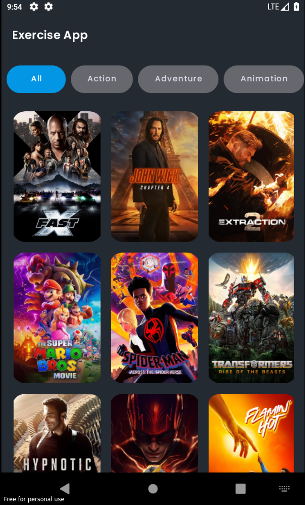
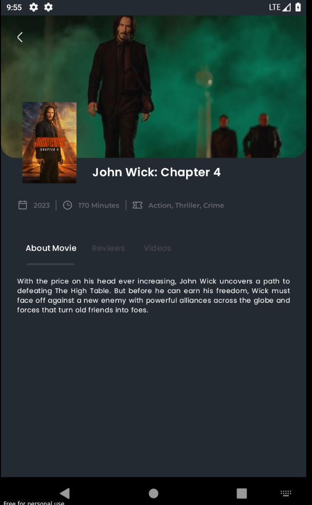
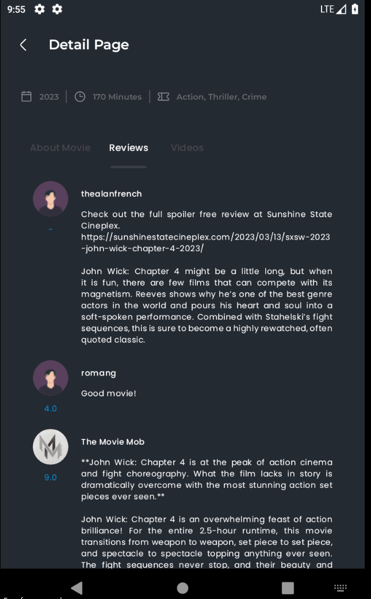
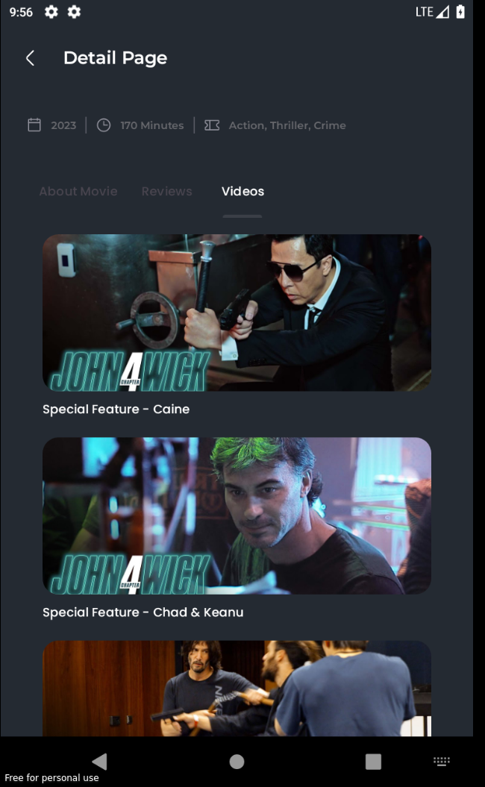

# TMDB
This project is used to completing assessment task in 2 days

## Requirement

To build this project, we need to generate API Key first from [TMDB](https://developer.themoviedb.org/reference/intro/getting-started), then put it in `gradle.properties` with property's name `tmdb.api.key`.

## Showcase

